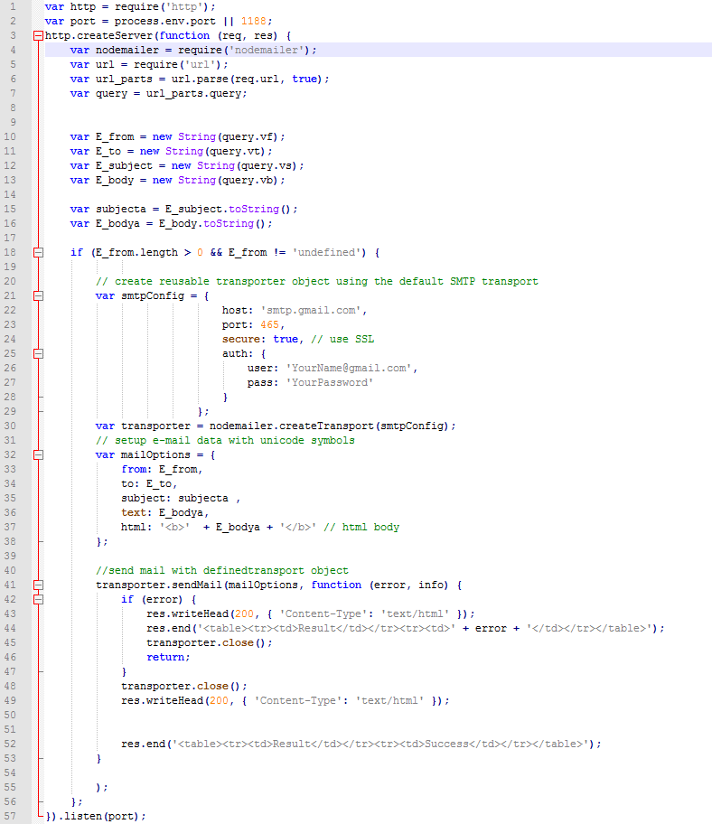

QlikSense: Sending Email Alerts from a load script based on data conditions
===========================================================================

This setup allows you to send dynamic email alerts from  Qliksense load script
based on data conditions/metric values such as Average Sales \> 10000.

It uses the web file data source feature of Sense to call a NodeJS page that
send SMTP email alerts based on URL parameters. It uses a nodeJS package called
**nodemailer** to send out the email alerts. Currently these parameters are
From, To, Subject & Body. NodeJS server page in this project is designed to
store the email SMTP server credentials as part of the server.js file so all
emails will be sent from a central account. Code can be easily modified to take
User/PW values as parameters as well so this can be controlled from the load
script as well.

**\*\*\* Calling Dynamic URLs for data load used in this method requires
QlikSense server to be set to Legacy Mode**

*Warning/Disclaimer: This project is just a proof of concept design and not
intended for commercial. It can be used as a starting point by customers to
create a more bullet proof page with proper error handling functions. Even
though server piece is done in NodeJS and running under QlikSense dispatcher, it
can easily be done in other platforms such as .Net and hosted on a IIS server.*

Step-by-step guide
------------------

Here are the step

1.  Make sure QlikSense(Desktop or Enterprise) is set up to use Legacy Mode.

2.  Download the source files
    here. [EmailAlertSetup.zip](https://github.com/NickAkincilar/QlikSense-Data-Driven-Email-Alerts/raw/Version1/SourceFiles/EmailAlertSetup.zip)

3.  UnZip the file in to a local folder.

4.  In the Zip file you will few items:

    1.  **EmailAlert** folder : Copy the **EmailAlert** folder to "**C:\\Program
        Files\\Qlik\\Sense\\**" location so the resulting path is "C:\\Program
        Files\\Qlik\\Sense\\EmailAlert\\"

    2.  Open the "**C:\\Program Files\\Qlik\\Sense\\EmailAlert\\server.js**"
        with a text editor and edit SMTP Config section starting at line 21 with
        your own SMTP server name and credentials. In the file, I am using gmail
        as the server. If that is the case there is an extra step to edit your
        Gmail Security settings to allow 3rd party SMTP connections.

    3.  Open **"Add This to services.conf file.txt" file**:  

        1.  Copy the contents of this file.

        2.  **Stop** QlikSense Service Dispatcher service.

        3.  Open "**C:\\Program
            Files\\Qlik\\Sense\\ServiceDispatcher\\services.conf**" file and
            paste the information at the end of the file.

        4.  Save **services.conf**

        5.  **Start **QlikSense Service Dispatcher service**.**

5.  Create a new app

6.  Copy the script from the **sampleLoadScript.txt** file in to load editor.

7.  Modify the vFrom and VTo variables with the actual email addresses.

8.  Click on Load 

Server.js file:
===============

Services.conf file addition:
============================

[emailalert]  
Identity=Qlik.EmailAlert  
Enabled=true  
DisplayName=EmailAlert  
ExecType=nodejs  
ExePath=Node\\node.exe  
Script=..\\emailalert\\server.js

Sample Load Script
==================

